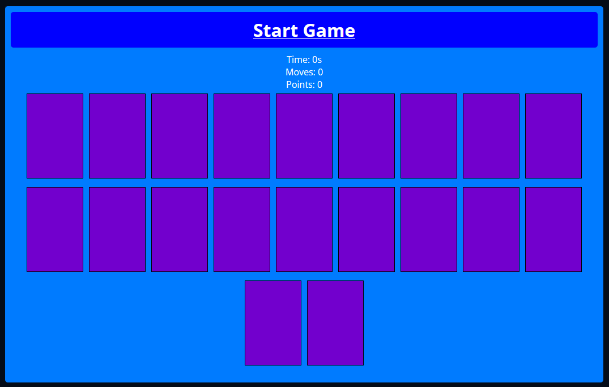
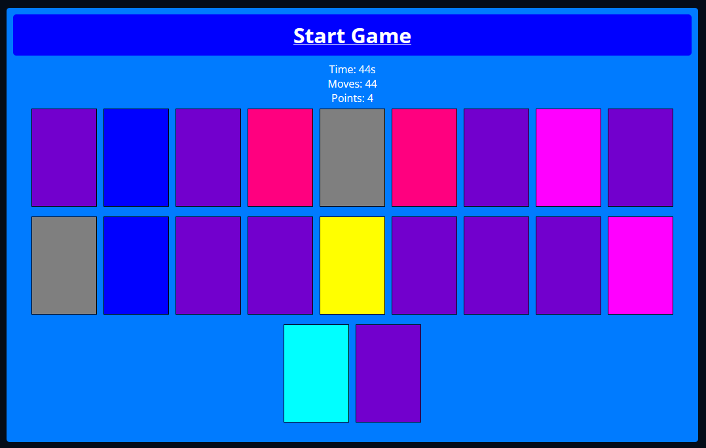

# Pairs

This is the code for the Pairs game, as part of the Software Development 1 course.

For project details, see [the project's README](https://github.com/MeenaSoftwareDevelopment/.github/blob/main/profile/README.md).

We utilized Vite as a tool to set up and facilitate the development of our React-based Pairs game. The game logic, interface designs, and styles were created by us.

## Installation

It's a browser game, there is no installation.

## Gameplay

To start the game, click **Start Game**, and the timer will begin counting up.

Once the timer starts, click on any of the cards, and match two of them.

> ⚠️ **Don't click the cards too fast!** This can cause the logic to break.

Once you've matched them all, you win!

You can reload the page or press the <kbd>F5</kbd> or <kbd>⌘ + R</kbd> key to play again.

You can also press <kbd>Ctrl + W</kbd> or <kbd>⌘ + W</kbd> to close the game.
